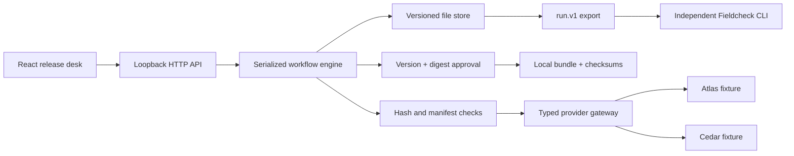

# Architecture and deliberate trade-offs

The gateway stays in the flagship because there is one consumer. A separate package would add release/version coordination before an independent consumer exists. The Python evaluator has a real separate boundary: a portable, versioned JSONL input and a report, with no Node or service dependency.

## State and authorization boundary

`reviewing → awaiting_approval → approved → completed`; a review may enter `failed`, and a pending human decision may enter `rejected`. A retry is explicit. A revised input returns to review with `approval`, `review` and `delivery` cleared. Old bundles remain on disk as history, but the current API exposes only a completed bundle for the current input.

Manifest digest covers ordered asset identities, names, content hashes, media types, duration and version. Actual bytes are rechecked before review, approval and delivery. Approval stores the digest and version. The delivery boundary checks both independently of UI controls. Every mutating command includes an expected run revision, so stale tabs receive HTTP 409.

Approval is a local demo decision, not an authenticated person or organization authorization. The audit is inspectable but not signed, immutable, or tamper-proof.

## Provider failure policy

Each review segment attempts at most two providers in fixed order, with a default 25 ms deadline per fixture. Timeout, unavailable and invalid output permit fallback. An explicit refusal stops routing. Responses must satisfy the strict review schema and cite known asset IDs. Abort signals are sent at deadlines; an adapter that ignores cancellation may continue background work, so real adapters would need additional resource controls.

Elapsed time is measured with `performance.now()`. It includes local fixture code and scheduling. No live provider, pricing, token usage, model quality or production latency is measured. All output strings are fixtures, not LLM inference.

## Persistence and idempotency

The engine serializes all commands in one process. State is schema-validated, written to a temporary user-only file, fsynced, then atomically renamed. Memory updates after the file replacement. A persisted `reviewing` state becomes `failed/interrupted` on startup; retry uses its saved manifest. A separate approved checkpoint survives interruption before delivery.

Idempotency keys are global to the local store, paired with a fingerprint of the target, action and expected revision (or create scenario). Replaying a matching key returns the **current** run, not an exact cached HTTP response. Reuse with different input is rejected. A review key is recorded before adapter execution; after a crash it returns the recovered state, and a **new explicit retry command** is required. Provider effects themselves are not exactly once.

Local delivery uses an input-derived directory and verifies an existing bundle before accepting a replay. The bundle's audit snapshot ends before `delivery.created` to avoid a self-referential checksum. The state audit records completion afterward. The downloaded JSON envelope includes the six real files; it is not a ZIP. `checksums.sha256` covers the five other files, while the exported delivery manifest also hashes that checksum file.

This is a bounded, trusted-machine design: 100 runs, 2,000 command receipts, one process per data directory. There is no interprocess lock, database transaction across the file store and bundle directory, distributed coordination or guaranteed power-loss durability. Two processes sharing a directory are unsupported. A deployment would require database transactions/outbox, authenticated actors, quotas, retention and operational recovery.

## Security defaults

Loopback binding; exact local Host and Origin checks; no CORS; 8 KiB JSON mutation limit; strict request schemas; fixed synthetic inputs; no arbitrary path, URL or shell tools; no environment credential reads; no raw provider error details; CSP, frame denial and `nosniff`; React escapes text. Files are written with user-only permissions. Bundle download verifies actual bytes and safe filenames.

These defaults reduce accidental exposure and cross-origin mutations. They do not protect against malicious software running as the same local user. The server must not be exposed on a network without a new authentication and threat-model review.
